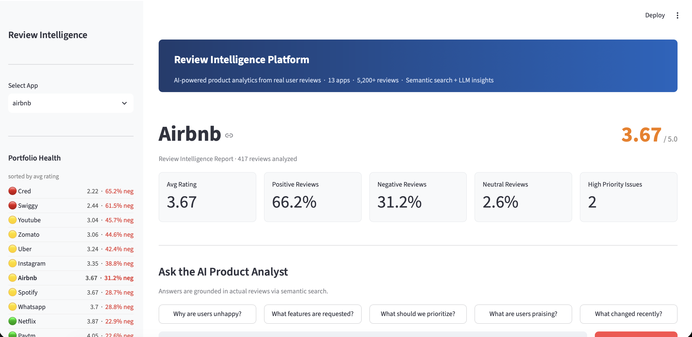
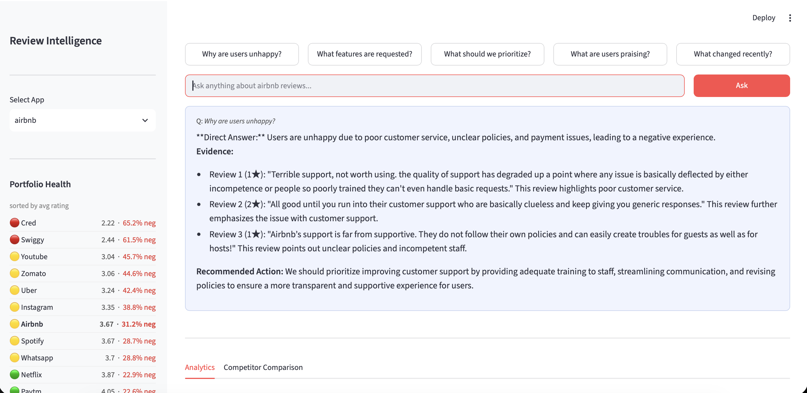
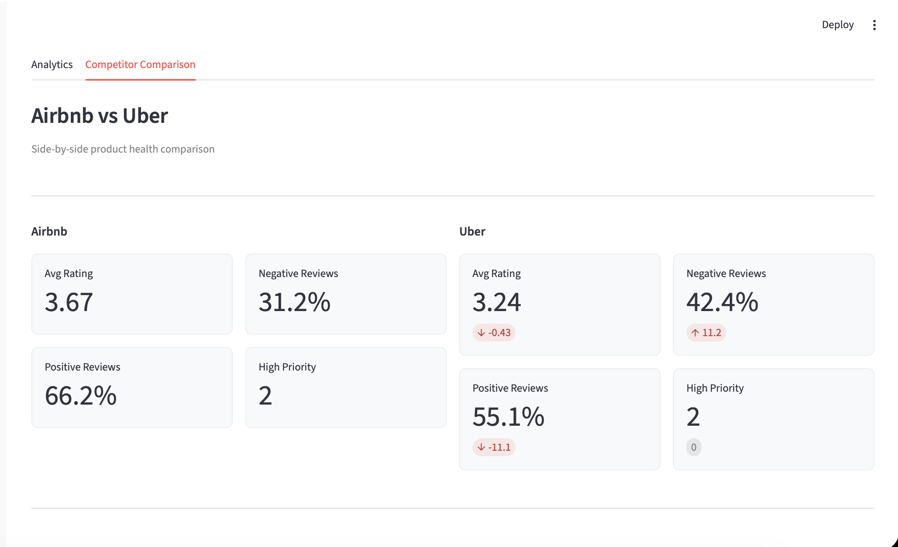
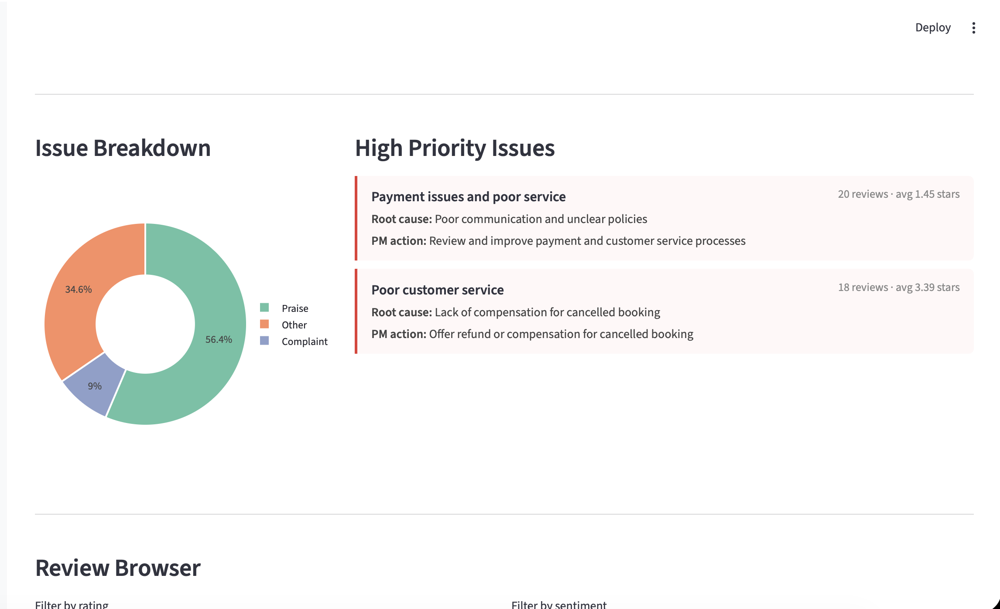

# Review Intelligence Platform

AI-powered product analytics that transforms app store reviews into actionable insights for Product Managers.

---

## What it does

Most review analysis tools give you a pie chart. This gives you answers.

A PM can ask "Why are users unhappy with Swiggy?" and get a response grounded in actual reviews — with citations, root causes, and a recommended action. Every insight traces back to real user feedback.

**Covers 13 major apps:** Spotify, Instagram, Zomato, Swiggy, Paytm, PhonePe, Airbnb, Netflix, Uber, WhatsApp, YouTube, CRED, Duolingo

---

## Features

- **AI Product Analyst** — Ask questions in plain English, get evidence-backed answers via RAG
- **Topic Discovery** — BERTopic automatically clusters reviews into meaningful themes
- **Sentiment Analysis** — VADER scoring across 5,200+ reviews
- **Trend Detection** — Weekly rating trends surface version-related issues
- **Competitor Comparison** — Side-by-side analysis (Zomato vs Swiggy, Paytm vs PhonePe)
- **Priority Scoring** — Issues ranked by frequency, severity, and recency

---

## Architecture

```
Google Play Store
      |
      v
google-play-scraper
      |
      v
Pandas cleaning -- Parquet storage
      |
      v
VADER sentiment + MiniLM embeddings
      |
      v
BERTopic clustering -- FAISS index
      |
      v
Groq LLM (Llama 3.1) extraction
      |
      v
Streamlit dashboard + RAG chat
```

---

## Tech Stack

| Layer | Technology | Why |
|---|---|---|
| Data collection | google-play-scraper | Direct Play Store access |
| Processing | Pandas, Parquet | Fast, typed storage |
| Sentiment | VADER | Rule-based, no API cost |
| Embeddings | sentence-transformers MiniLM | Free, 384-dim, production-grade |
| Vector search | FAISS | Efficient similarity search |
| Topic modeling | BERTopic | State-of-the-art short-text clustering |
| LLM | Groq API Llama 3.1 | Free tier, fast inference |
| Dashboard | Streamlit | Rapid, clean UI |

---

## Project Structure

```
app-review-analyst/
    data/
        raw/            original CSVs from Play Store
        processed/      cleaned Parquet files
    analysis/           topic JSON and LLM insights
    vectors/            FAISS indexes and embeddings
    scripts/
        scrape_reviews.py
        clean_reviews.py
        sentiment.py
        embed_reviews.py
        topic_model.py
        llm_extract.py
        build_analytics.py
    dashboard/
        app.py          Streamlit dashboard
    requirements.txt
```

---

## Running Locally

```bash
git clone https://github.com/mansha5/app-review-analyst.git
cd app-review-analyst
python -m venv venv
source venv/bin/activate
pip install -r requirements.txt
```

Add your Groq API key to a .env file:

```
GROQ_API_KEY=your_key_here
```

Run the dashboard:

```bash
streamlit run dashboard/app.py
```

To re-run the full pipeline from scratch:

```bash
python scripts/scrape_reviews.py
python scripts/clean_reviews.py
python scripts/sentiment.py
python scripts/embed_reviews.py
python scripts/topic_model.py
python scripts/llm_extract.py
python scripts/build_analytics.py
```

---

## Screenshots






## Key Design Decisions

**Why BERTopic over LDA?** LDA assumes bag-of-words and struggles with short texts like reviews. BERTopic uses sentence embeddings which capture semantic meaning so "terrible wait time" and "driver never showed up" cluster together correctly.

**Why pre-compute instead of live LLM calls?** The dashboard reads from JSON files with zero LLM calls at runtime. Only the RAG chat calls Groq, and only when a user asks a question. This keeps costs near zero and makes the dashboard instant.

**Why VADER plus embeddings?** VADER scores all reviews in milliseconds for baseline sentiment. Embeddings capture semantic similarity for clustering and retrieval. Using both is more defensible than either alone.

---

## What I would add in production

- PostgreSQL for multi-user data isolation
- FastAPI backend with React frontend
- Scheduled ingestion via Play Store API
- Fine-tuned sentiment model on app review domain
- User authentication and saved reports

---

Built as a portfolio project demonstrating AI/ML, NLP, and product thinking.